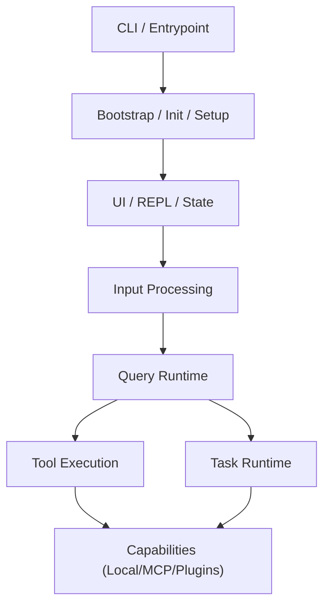

# ⚙️ CORE RUNTIME: The 8-Layer Architecture

An engineering deep-dive into the "Unified Agent Runtime" found in the Claude Code leak, synthesized from the **Claw-Rust** architectural teardown.

## 🏗️ Project Essence
Claude Code is not just a CLI chat tool; it is a **Unified Agent Runtime** designed for full-lifecycle software engineering. The architecture is organized into 8 distinct layers that manage everything from UI rendering to recursive model-tool loops.

## 🧱 The 8-Layer Breakdown

### 1-2. Bootstrap & Environment
- **Role:** Assembly of tools, agents, and MCP configurations. Sets up the `AsyncLocalStorage` context and durable session IDs.
- **Key Files:** `main.tsx`, `setup.ts`, `bootstrap/state.js`.

### 3. UI / REPL / State
- **Role:** Renders the terminal interface via **Ink/React**. Manages the `AppState` (messages, permission modes, task list).
- **Insight:** The UI is decoupled from the runtime logic to allow for headless/SDK execution.

### 4. Input Processing
- **Role:** Handles slash commands, pastes, and attachments. It acts as the "Compiler Frontend," converting raw input into structured messages.

### 5. Query Runtime (The Core Loop) 🌀
- **Role:** The recursive engine that drives every "Agent Turn."
- **Functions:** Model stream handling, `tool_use` detection, `tool_result` feedback, and **Context Governance** (Context Collapse, Auto-Compacting).
- **Key Files:** `query.ts`, `QueryEngine.ts`.

### 6-7. Tool vs. Task Execution
This is the most critical engineering abstraction in the Hub:
- **Tool:** A synchronous, model-visible interface (e.g., `Bash`, `FileEdit`, `MCP`).
- **Task:** A long-running execute entity (e.g., background Shell, sub-Agent).
- **Insight:** Tasks allow the CLI to remain interactive while heavy processes run in the background.

### 8. Extension Layer (MCP, Skills, Plugins)
- **Role:** The boundary of the system. MCP (Model Context Protocol) is an "First-Class" capability, not an add-on.

## 🧠 Why it Matters
This architecture shows that Claude Code was built for **Session Stability**. It is optimized for multi-hour coding sessions where the context grows massive, requiring advanced **Compact/Memory** mechanisms (found in `src/services/compact/`) to keep the model performant.

---
*Synthesized by ORACLE based on the Claw-Rust (CN) Architectural Teardown.*
